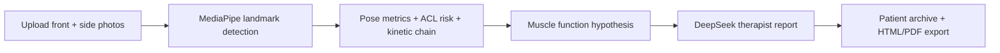

# KinetiQ

**AI-powered sports rehabilitation screening for therapists**

KinetiQ turns front and side posture photos into a structured rehab workflow: local pose landmark analysis, ACL risk stratification, muscle-function hypotheses, DeepSeek-generated therapist reports, patient archives, and HTML/PDF export.

Choose your preferred language:

- [English README](./README_EN.md)
- [中文 README](./README_ZH.md)

## Why this project

Most rehab demos stop at keypoint detection. KinetiQ goes one step further:

- It translates pose landmarks into clinically relevant findings.
- It highlights possible muscle-function issues instead of only saying "good" or "bad".
- It generates therapist-facing reports with actionable rehab guidance.
- It keeps patient history so follow-up sessions can compare progress.

## Highlights

- Front and side photo upload
- Annotated pose images saved with each assessment
- ACL risk assessment and kinetic-chain summary
- Muscle-function hypothesis mapping
- DeepSeek AI report generation with local fallback
- Patient archive and search
- Markdown, HTML, and PDF export

## Workflow



## Quick Start

1. Create and activate a virtual environment.
2. Install dependencies.
3. Put `pose_landmarker.task` in the project root.
4. Set `DEEPSEEK_API_KEY` if you want AI-generated reports.
5. Run the app:

```bash
streamlit run main.py
```

## What you get

- A therapist-friendly summary for each assessment
- Annotated front and side images
- A downloadable report in Markdown, HTML, and PDF
- A local fallback report if the DeepSeek key is missing

## Project Structure

- `main.py` - Streamlit UI
- `app_pipeline.py` - complete assessment pipeline
- `pose.py` - MediaPipe detection and annotated image generation
- `analysis.py` - pose metrics and risk summary
- `clinical_knowledge.py` - muscle mapping and report templates
- `deepseek_client.py` - DeepSeek API client
- `records_store.py` - patient archive storage
- `report_export.py` - HTML/PDF report export

## Notes

- Patient data and uploaded images are stored locally under `data/`.
- This project is for screening and workflow support, not medical diagnosis.
- If you want to publish a public demo later, adding screenshots or a short GIF will help a lot.
