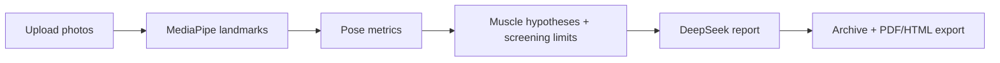

# KinetiQ

KinetiQ is an AI-assisted sports rehabilitation screening app built with Streamlit. It recognizes front, back, side, forward-bend, and other pose photos, retrieves same-type MPII landmark cases from a multi-view local RAG index, describes the visible MediaPipe geometry appropriate to each capture type, and uses DeepSeek to generate therapist-facing reports. Static photos do not receive an ACL injury-risk grade.

## Features

- Front and side photo upload
- Annotated pose images
- ACL screening limits (dynamic testing required)
- Kinetic-chain analysis
- Muscle-function hypothesis mapping
- DeepSeek-powered therapist reports
- Patient archive and history search
- Local posture RAG and post-analysis improvement priorities
- User-confirmed low-load training plans
- Markdown, HTML, and PDF export

## Why it stands out

- It combines computer vision with clinically useful reasoning.
- It presents outputs in a therapist-friendly workflow.
- It stores patient history for follow-up comparisons.
- It can fall back to a local report template when the API key is not available.

## Workflow



## Quick Start

1. Create and activate a virtual environment.
2. Install dependencies.
3. Put `pose_landmarker.task` in the project root.
4. Set `DEEPSEEK_API_KEY` if you want AI-generated reports.
5. Start the app:

```bash
streamlit run main.py
```

## Project Structure

- `main.py`: Streamlit UI
- `app_pipeline.py`: end-to-end assessment pipeline
- `pose.py`: MediaPipe pose detection and annotated image generation
- `analysis.py`: pose metrics, capture-quality gating, kinetic-chain summary, and ACL screening limits
- `clinical_knowledge.py`: muscle mapping and report templates
- `deepseek_client.py`: DeepSeek API client
- `records_store.py`: patient archive storage
- `report_export.py`: HTML and PDF export helpers
- `posture_rag.py`: local vector and structural-similarity retrieval
- `recommendation_engine.py`: explainable recommendations and confirmed plans

## Notes

- Patient records and uploaded images are stored locally under `data/`.
- The app falls back to a local therapist-style report template when the API key is missing.
- This project is intended for screening and workflow support, not medical diagnosis.
